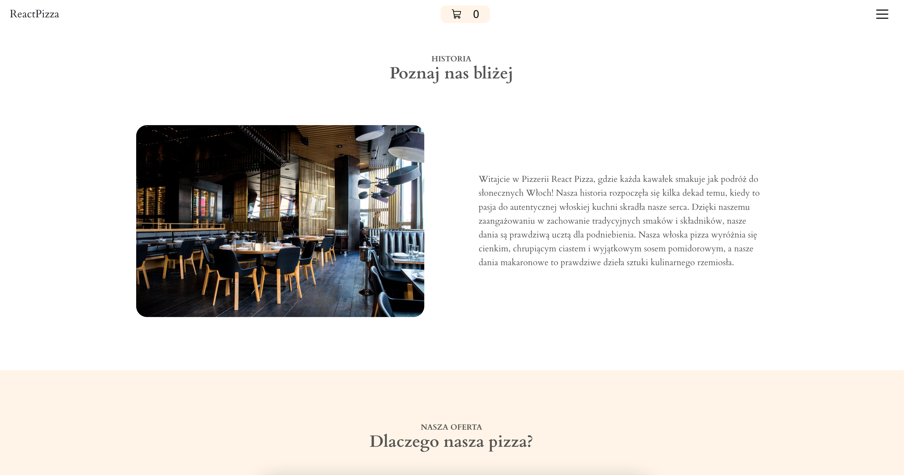

## Project Overview 🎉

A fictional pizzeria website was created by me. The site has a menu added from Firebase and there is an option to send an order to the Firebase server. The site uses Context to store the shopping cart. I created four hookups that are responsible for fetching and sending data, displaying inputs, creating animations and for validation. The site is fully responsive for all devices.

## Tech/framework used 🔧

## Screenshots 📺

    

       

    

    

    

    

    

## Installation 💾
`git clone https://github.com/mstobiecki/react-pizza.git` and npm run start

## Available scripts

| Command        | Description | 
| -------------- | ----------- | 
| `npm run start` | Run development server    |     
| `npm run build` | Run application building    |     

## Live 📍

<a href="https://react-pizza-mstobiecki.netlify.app/">https://react-pizza-mstobiecki.netlify.app/</a>

